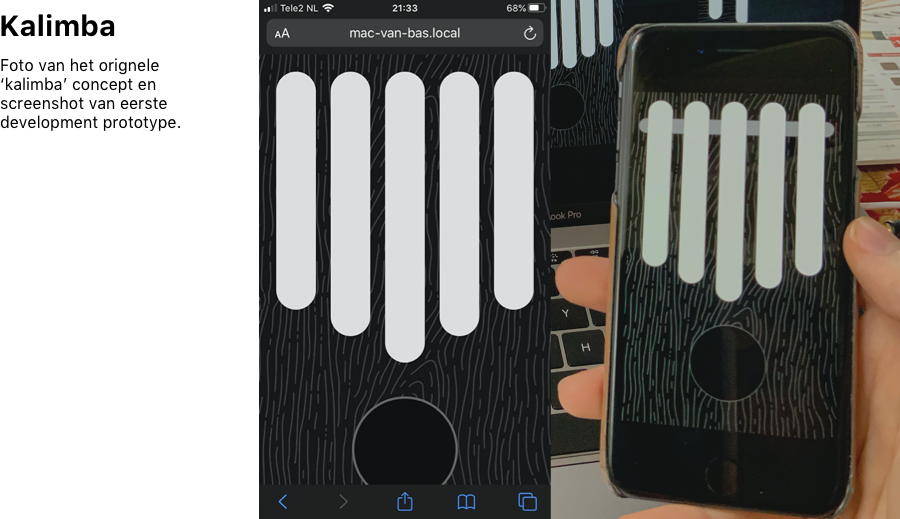
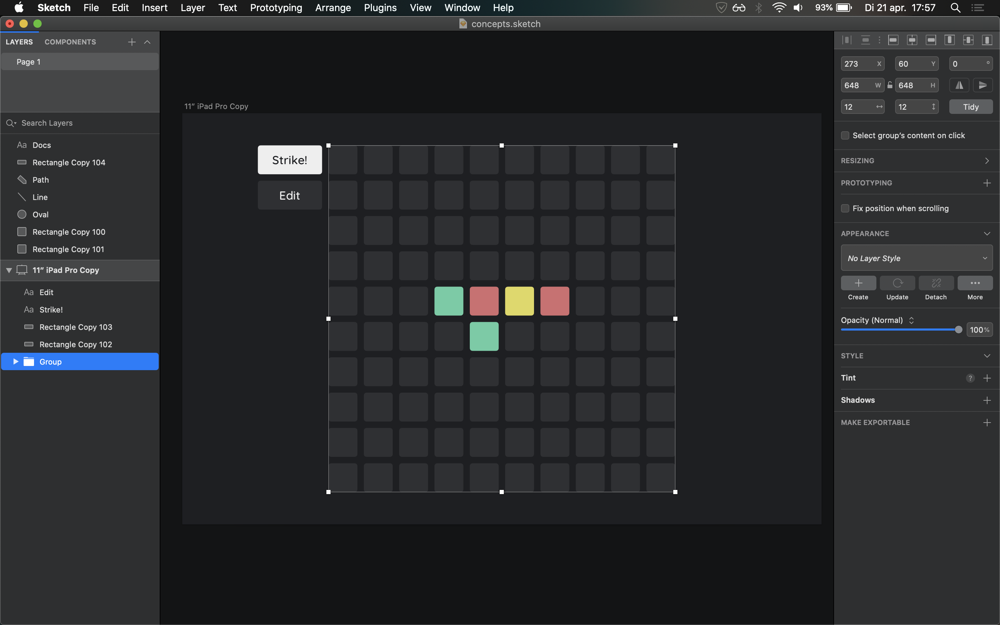

# DOCS

Documentation regarding Creative System Design 2D assignment:

## Het proces

Ik ben al een tijdje bezig met het onderzoeken van web-apps maken met audio, daarom heb ik meteen de playfull app opdracht gekozen.

Tijdens het bedenken van __het concept__ heb ik nagedacht over manieren van muziek maken die passen bij touch-devices zoals smartphones en tablets.

__Mijn eerste concept__ wat hier uit kwam was het idee om een kalimba app te maken voor de smartphone omdat de vorm van een kalimba en de manier waarop je het vasthoud, lijkt op die van een smartphone. Ik had een schets en een kort prototype gemaakt van dit concept maar uiteindelijk kwam ik erachter dat het niet heel speels was; de app was eigenlijk een stel statische knoppen waar je met je vingen overeen bewoog.
Daarna heb ik gekozen om met een deel van de kalimba code, opnieuw te beginnen.

## Het concept

Als tweede idee had ik bedacht om een soort sequencer te maken op een 2d grid; Waarbij verschillende kleuren verschillende tonen/geluiden creëeren. Wanneer de speler/gebruiker op een van de gekleurde knoppen drukt speelt er een toon en worden, na een bepaalde tijd, de knoppen ernaast ook aangeslagen. Door gekleurde knoppen naast elkaar te zetten kan je een sequence van tonen maken.

De app heeft 2 modi:
* __Edit__

    In deze modus kan de gebruiker de knoppen van kleur veranderen

* __Play / Strike__

    In deze modus maken de knoppen geluid wanneer ze worden aangeslagen

__Interessant__ aan dit concept vond ik dat je met een simpel concept van knoppen die de knoppen ernaast aanslaan vrij complexe melodieën en akkoorden kan maken. Bovendien kan je de sequence op elk moment in de sequence beginnen door een andere knop aan te raken.

> Screenshot van app tijdens design proces

## De uitvoering

Dit zijn een aantal belangrijke dingen voor het uitvoeren van de web-app:

* Het maken van het grid met html elementen en css (genereren met javascript)
* De aanraking werkend krijgen (met addEventListener's)
* Kleurverandering en animaties (css manipulatie)
* De geluiden / synthese (met Tone.js)
* Knoppen die andere knoppen aanslaan (zonder feedback loops te creëeren)
* De synthese ook echt mooi laten klinken en polyfoon maken

## Het verloop

__Het genereren__ van de knoppen met javascript en ze stylen met css bleek makkelijker dan verwacht, mijn minimale webdesign kennis kwam van pas. Ik heb voor elke knop in het grid een class gemaakt zodat alle knop code in een los bestand staat. Ik weet nu hoe arrow functions werken in javascript, dit is erg nuttig voor het toevoegen van eventListeners vanuit de button class (om de klik van elke knop te registereren).

__Tone.js__ is een heel krachtige library voor audio synthese in javascript. Ik heb met redelijk weinig moeite een polyfone synthesiser gemaakt en die gekoppeld aan alle knoppen.